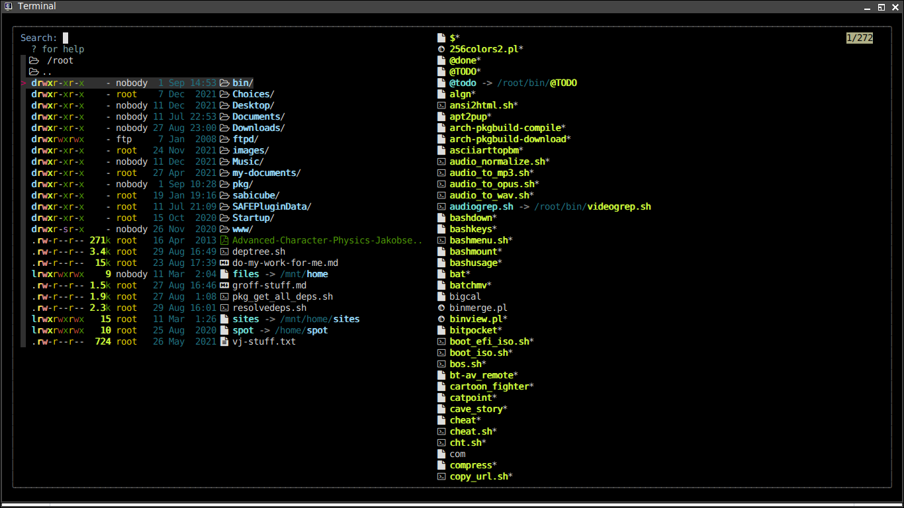

# fzf filemanager

A file manager for the terminal, using `fzf`.

## Screenshot



## Features

- fast navigation
- sensible key bindings
- easy directory & file searching
- file previews of various types
- open selected file(s) in various programs, based on MIME type or extension
- integrated command prompt

Has 2 modes:

- filemanager: browse and select files and folders
- shellprompt: run commands on the current selection

This is a hack, not than a proper thing, don't expect too much.

## Requirements

- `fzf` - used for filtering and choosing files & dirs
- `exa` - used for listing dirs (supports `.gitignore`, icons, ..)
- `bat` - used for colourful file previews
- `fd`  - used for Alt-C (finding lots of dirs, many levels deep)

The above dependences (except `fzf`) could be replaced with regular GNU tools like `ls`, `cat`, `find`.

## Install

Copy `filemanager` to a folder in your `$PATH`.

## Usage

```
filemanager [-fs] [path/to/dir]

```

You can load _fzf filemanager_ fullscreen (`-fs`) and pass the directory to start in.

## "file manager" mode

You can navigate around your files and folders, TAB to multi-select, 
or ENTER to open current selection, ESC to clear your selection.

If you open one file, it's mime-type will be used to decide what to do.

If you open many files, and they're of the same type, they will all be 
opened together in the same program (your preferred, editor, player, etc).

If you chose files of different types, they'll be opened one after the other.

Alternatively, you can TAB select multiple files and press `!` to open the 
"shellprompt" mode, where you can run any commands you like against the selection.

## "shell prompt" mode

Here you can run commands on the "current selection" (the files/dirs you 
chose using enter or tab, in the file manager). 

You will see a long list of commands, type to filter them and choose the 
command you want to run.

Hit enter to run the chosen command on _each item_ in the "current selection".

## Key bindings

### Key bindings: all modes

- **!** - enter/exit shell prompt mode
- **ctrl-q** - quit

### Key Bindings: "filemanager" mode

1. Navigation:

- **up/down** - move up and down the file/dir list
- **left** - cd to `..`
- **right** - cd into the current dir, or open the currently selected file(s)
- **shift+up/down** or **page-up/page-down** - move up and down, half a page at a time
- **shift+left/right** or **] and [** - scroll the preview panel up and down 

2. Choosing items:

- **enter** or **/** - choose item
- **tab** - toggle item (multi select) and move down
- **shift-tab** - toggle item (multi-select) and move up
- **escape** - clear selection

3. File manager controls

- **shift+/** - (the `?` key) a help menu showing the controls
- **ctrl-l** - toggle "long" (detailed) list view
- **ctrl-h** - toggle show/hide hidden files
- **ctrl-p** - toggle show/hide the preview panel
- **alt-c** - list & filter all dirs from `.`, hit enter to `cd` into one

4. Searching

Just type stuff while in any dir to start filtering the list.

### Key Bindings: "shell prompt" mode

- **up/down** - move up and down the command list
- **shift+up/down** - move up and down your command history
- **tab** - complete the selected command, in one go
- **enter** - choose and run the chosen command on the selected files/dirs
- **ctrl-q** - exit back to main prompt menu, or exit program

## Contributing

**Pull Requests** welcome.

Just read the Issues page, pick one, fix it, issue a PR.

Also see the lines marked `@TODO`, at the top of the script itself.

